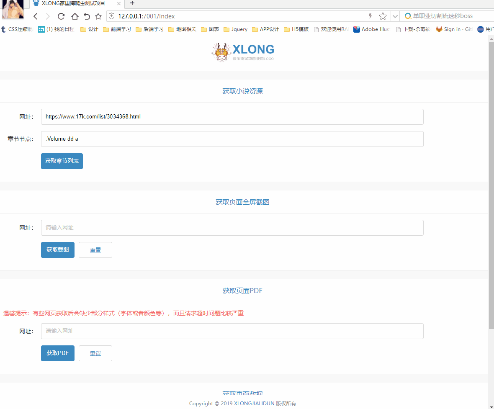
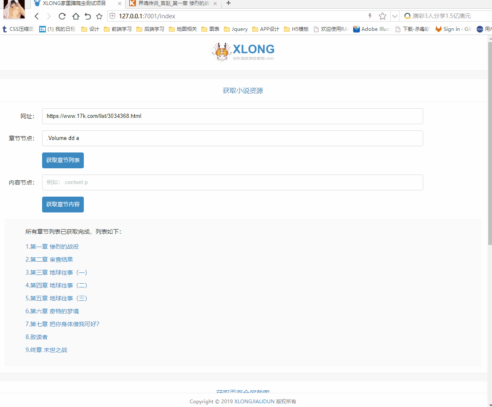
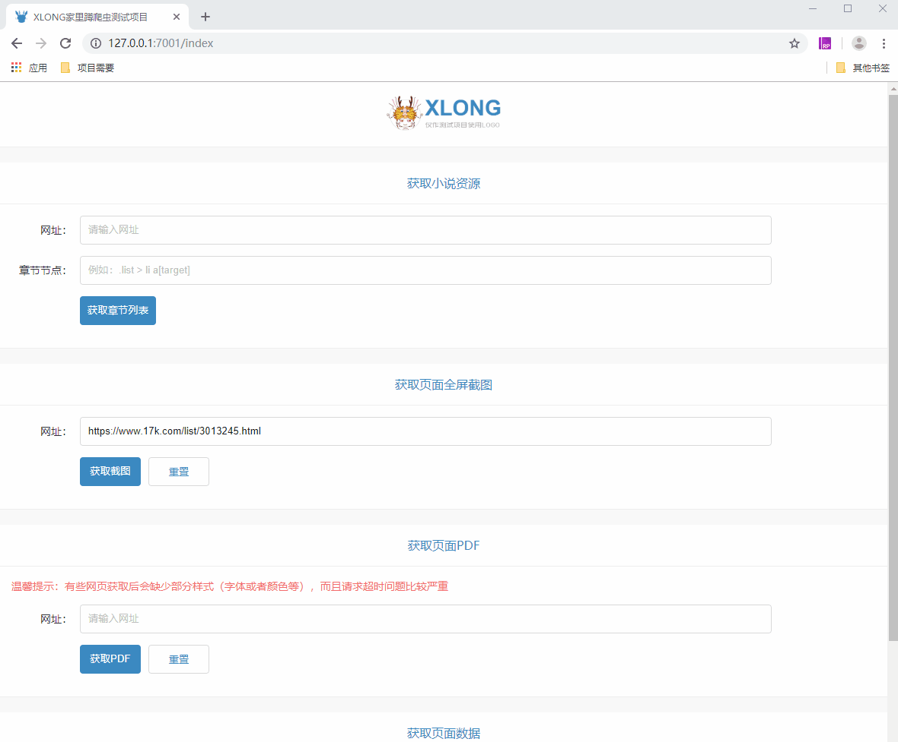
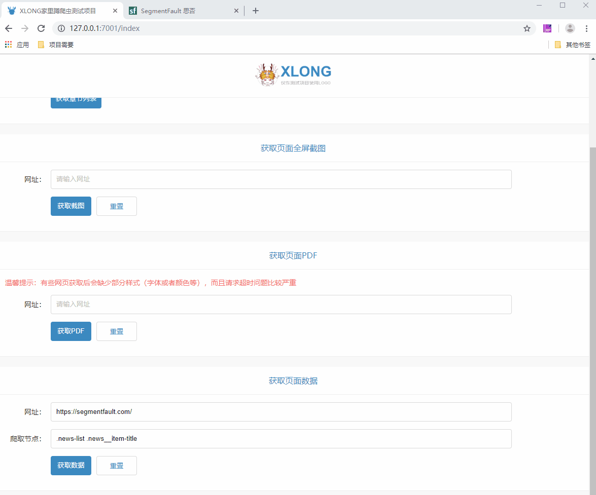

# xlong-spider-egg

## 介绍

xlong-spider-egg 是一套基于Egg + Puppeteer + Sqlite3 开发的简易版爬虫项目（仅供学习和娱乐，请勿商用）。

## 项目说明

#### 1. 包含功能
- 可通过配置的节点获取小说内容并下载
- 可通过配置的节点获取网页相关信息
- 可截取网页图片，存储为jpg格式图片
- 可获取网页信息，存储为pdf文件

#### 2. 项目用到技术、框架与插件
[Node.js](https://github.com/nodejs)  
[Egg.js](https://github.com/eggjs)   
[egg-view-nunjucks](https://github.com/eggjs/egg-view-nunjucks)  
[puppeteer](https://github.com/GoogleChrome/puppeteer)  
[node-sqlite3](https://github.com/mapbox/node-sqlite3)  

#### 3. 浏览器兼容性
响应式页面，主要兼容浏览器：IE10+、IE Edge、Safai、Firefox、Chrome等。

## 部分项目运行截图
* 获取小说






* 获取截图



* 获取数据




## 目录结构

```
│  .autod.conf.js
│  .eslintignore
│  .eslintrc
│  .gitignore
│  .travis.yml
│  app.js // 项目启动配置，连接数据库
│  appveyor.yml
│  jsconfig.json
│  package.json
│  README.md
│
├─.vscode // vscode配置，用于配置less
│
├─static // 静态文件，保存项目截图
│
├─database
│     spider.db // SQLite数据库
│     README.md // 数据库设计说明
│
├─app
│  │  router.js // 路由配置
│  │
│  │
│  ├─controller
│  │   home.js // 前台相关controller
│  │
│  ├─extend
│  │     helper.js // 用来提供一些实用的 utility 函数
│  │
│  ├─public
│  │  │
│  │  ├─common // 通用模块
│  │  │
│  │  ├─upload // 爬取信息存储位置
│  │  │
│  │  └─home // 前台项目静态资源
│  │
│  ├─service // 用来执行具体的操作
│  │    sqliteDB.js // Sqlite查询封装方法
│  │    browser.js // 浏览器相关操作 
│  │    spider.js // 爬虫相关服务
│  │    store.js // 文件存储服务 
│  │    index.js // 前台服务
│  │
│  └─view // 模板文件
│
├─config
│     config.default.js // 项目配置相关
│     plugin.js // 插件
│
└─test // 测试相关
    └─app
        └─controller
            home.test.js
```

## 本地运行
1. 安装前台依赖
> npm install

2. 运行项目
* 默认端口启动：
> npm start

访问地址：http://localhost:4200

* 自定义端口启动：
> ng serve --port 4201 --open

访问地址：http://localhost:4201，--open 指令会自动启动浏览器

## 项目测试
> npm run test

## 项目打包
> npm run build

## Angular官方项目学习
在线例子： https://stackblitz.com/angular/vmeynjlxkqa

## 作者联系方式

QQ：381612175
TEL: 18376686974

github：https://github.com/xLong1029/

站酷主页：http://xlong.zcool.com.cn/

UI中国：http://i.ui.cn/ucenter/358591.html

* 此项目做学习Angular测试使用，有什么问题可联系我讨论